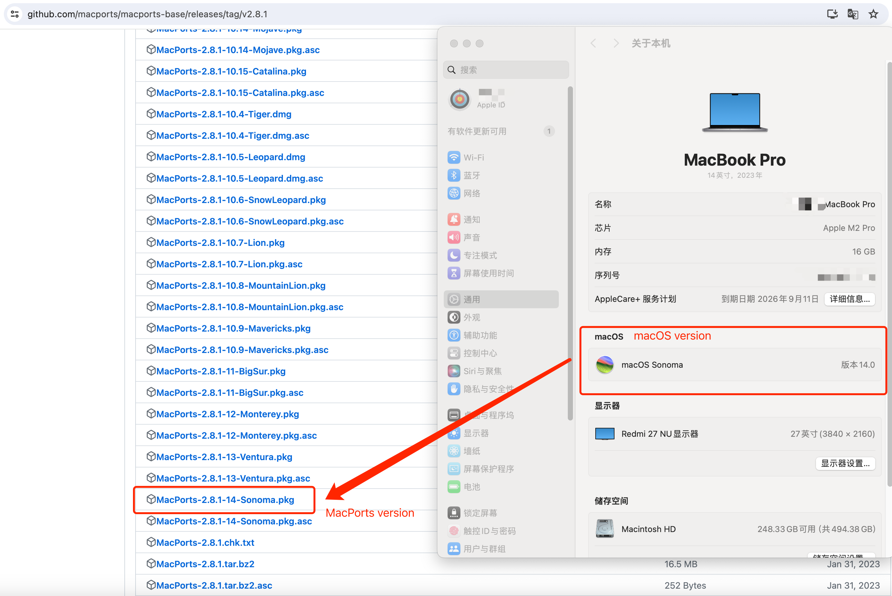

## microgeo: An R package rapidly showing the biogeographic traits of soil microbial community on maps


The [microgeo](https://github.com/ChaonanLi/microgeo) R package warps `ggplot2` and `ggspatial`, and other R packages involved in geographic information system (GIS) and machine learning such as `gstat`, `raster`, `terra`, `sf`, `sp` and `caret`. It permits the microbial biogeographical trait calculation, spatial data collection, and spatial interpolation, machine learning modeling/prediction and visualization for microbial biogeographical traits. Specifically, the [microgeo](https://github.com/ChaonanLi/microgeo) provides the flexible visualization methods for microbial traits onto maps, e.g., gridded-based visualization, spatial interpolation and machine learning, and it is not limited to those traits calculated by [microgeo](https://github.com/ChaonanLi/microgeo) package itself. Users can rapidly visualize any microbial traits calculated by other tools onto maps, and also can analyze microbiome dataset in conjunction with the data calculated by [microgeo](https://github.com/ChaonanLi/microgeo) R package. The [microgeo](https://github.com/ChaonanLi/microgeo) is currently undergoing continuous developments and updates. We welcome any ideas and suggestions. If you find any errors during use, please submit them to [GitHub Issues](https://github.com/ChaonanLi/microgeo/issues) or [Gitee Issues](https://gitee.com/bioape/microgeo/issues). 


The [microgeo](https://github.com/ChaonanLi/microgeo) R package requires `R >= 4.1.0` and several dependent R packages, and it is now available on both [GitHub](https://github.com/ChaonanLi/microgeo) and [Gitee](https://gitee.com/bioape/microgeo). The installation may take a few minutes because the dependencies, especially the installation on an Ubuntu OS. Please be patient and wait for the installation process to complete. If the installation is interrupted, you may need to install several libraries. Please pay attention to the prompts during the installation process for guidance. 

The [microgeo](https://github.com/ChaonanLi/microgeo) R package has been tested in the following environments:

|CPU	            |Cores	                |Memory (GB) |Operate system               |Architecture |R version     |
|-------------------|-----------------------|------------|-----------------------------|-------------|--------------|
|AMD EPYC 7Y43      |8 cores 16 threads     |16	         |Windows 10 (Virtual Machine) |x86          |4.3.2         |
|AMD EPYC 7Y43      |8 cores 16 threads     |16	         |Windows 11 (Virtual Machine) |x86          |4.3.2         |
|Intel Core i5-5350U|2 cores 4 threads      |8	         |macOS 12.7.2                 |x86          |4.3.2         |
|Apple M2 Pro       |10 cores 20 threads    |16          |macOS 14.0                   |arm          |4.3.2         |
|Apple M2           |8 cores 16 threads     |16	         |macOS 13.5.2                 |arm          |4.3.2         |
|AMD EPYC 7Y43      |92 cores 192 threads   |1024        |Ubuntu 18.04                 |x86          |4.1.0 to 4.3.2|
|AMD EPYC 7Y43      |92 cores 192 threads   |1024        |Ubuntu 20.04                 |x86          |4.1.0 to 4.3.2|
|AMD EPYC 7Y43      |92 cores 192 threads   |1024        |Ubuntu 22.04                 |x86          |4.1.0 to 4.3.2|

Before installing the [microgeo](https://github.com/ChaonanLi/microgeo) R package, there are a few additional steps to take. Here, we present the installation procedures on the three major operating systems.

## 1. Install dependencies

### 1.1 Install dependencies on Windows (64 bit, x86)

Before installing the [microgeo](https://github.com/ChaonanLi/microgeo) R package on a Windows OS, the [Git](https://git-scm.com/) and [RTools](https://cran.r-project.org/bin/windows/Rtools/) need to be installed. Notably, the version of [RTools](https://cran.r-project.org/bin/windows/Rtools/) must be compatible with the version of R base, and please pay attention to distinguish. For example, if your R version is 4.1.0, you should install the RTools 4.0; if your R version is 4.3.2, you should install RTools 4.3.


### 1.2 Install dependencies on macOS（ARM and x86）

The installation of [microgeo](https://github.com/ChaonanLi/microgeo) R package on a macOS requires `Xcode Command Line Tools` and several system libraries. We need to install the `Xcode Command Line Tools` if it is not avaliable on your Mac. Just run the following codes in your terminal, and install `Xcode Command Line Tools` according to the prompt in the pop-up window

```shell
xcode-select --install
```

#### 1.2.1 Install macOS dependencies using `Homebrew`

Usually, we can use the `Homebrew` to install the dependencies of [microgeo](https://github.com/ChaonanLi/microgeo) R package on a macOS. Firstly, we need to install the `Homebrew` if it is not avaliable on your Mac. Just run the following codes in your terminal. This step may take a few minutes, especially for the old versions of Mac.

```shell
# Install the `Homebrew`
# You may need to add `185.199.110.133 raw.githubusercontent.com` to `/etc/hosts` if the network can not connect to GitHub
/bin/bash -c "$(curl -fsSL https://raw.githubusercontent.com/Homebrew/install/HEAD/install.sh)" 

# Configure `Homebrew` if the `brew` command is not avaliable in your therminal
# The path of `brew` may be not the `/opt/homebrew/bin` in your Mac! 
# Run `dirname $(which brew)` to find a correct path on your macOS
echo 'export PATH="/opt/homebrew/bin:$PATH"' >> ~/.zshrc # The default terminal is `zsh` rather than `bash` in the new version of Mac; Run `echo $SHELL` to check it
echo 'export PATH="/opt/homebrew/bin:$PATH"' >> ~/.bash_profile # The default terminal is `bash` in the old version of Mac; Run `echo $SHELL` to check it
source ~/.zshrc && source ~/.bash_profile

# Check the version of `Homebrew`
brew --version
```

Switching the `Homebrew` package manager to a mirror or source within the country is often done to improve download speeds and reduce latency for users. `Homebrew` relies on external servers to fetch and install software packages, and using a local mirror can significantly enhance the installation process by utilizing servers located within the country. This helps to mitigate slow download speeds that may occur when fetching packages from international servers, resulting in a more efficient and faster software installation experience for users. Here's a specific example tailored for users in Mainland China.


```shell
# Check the default mirror or source of `Homebrew` 
# The default may be `https://github.com/Homebrew/brew.git`
cd "$(brew --repo)" && git remote -v 

# Switch the default mirror to the Aliyun mirror
git -C "$(brew --repo)" remote set-url origin https://mirrors.aliyun.com/homebrew/brew.git
echo 'export HOMEBREW_BOTTLE_DOMAIN=https://mirrors.aliyun.com/homebrew/homebrew-bottles' >> ~/.zshrc
echo 'export HOMEBREW_BOTTLE_DOMAIN=https://mirrors.aliyun.com/homebrew/homebrew-bottles' >> ~/.bash_profile
source ~/.zshrc && source ~/.bash_profile

# Update 
brew update

# Sometimes, you may need to exit and re-enter the terminal for changes to take effect.
# Run `cd "$(brew --repo)" && git remote -v` to check the changes before installing the system libraries using `brew`
```

Now, we can use `Homebrew` to install the system libraries required by [microgeo](https://github.com/ChaonanLi/microgeo) R packages. Just run the following codes.

```shell
brew install gdal
```

#### 1.2.2 Install macOS dependencies using `MacPorts`（**recommend**）

We also can use the [MacPorts](https://github.com/macports/macports-base/releases/tag/v2.8.1) to install the system libraries required by [microgeo](https://github.com/ChaonanLi/microgeo) R packages on a macOS. Please note that you must install a correct `MacPorts` version according to the version of your macOS. For example, I have a MacBook Pro with a macOS Sonoma v14.0, thus I need to install the `MacPorts-2.8.1-14-Sonoma.pkg`. Once the installation package is successfully downloaded, you only need to follow the installation wizard to complete the installation. **Please note: Remember to disconnect the network before installing, otherwise the installation process will be very, very slow！**



After successfully installing `MacPorts`, we need to add it to the system's environment variables. Otherwise, the `port` command can not be found in the terminal. Just run the following codes in your termal. 

```shell
dirname $(which port) # Find the location of `port` command in your macOS. It may be `/opt/local/bin`
echo 'export PATH="/opt/local/bin:/opt/local/sbin:$PATH"' >> ~/.zshrc # The default terminal is `zsh` rather than `bash` in the new version of Mac; Run `echo $SHELL` to check it
echo 'export PATH="/opt/local/bin:/opt/local/sbin:$PATH"' >> ~/.bash_profile # The default terminal is `bash` in the old version of Mac; Run `echo $SHELL` to check it
source ~/.zshrc && source ~/.bash_profile
port version # check the version of `MacPorts`
```

Now we can use the `MacPorts` to install system libraries required by [microgeo](https://github.com/ChaonanLi/microgeo) R packages on a macOS. Just run the following codes in your termal.

```shell
sudo port selfupdate
sudo port install gdal +hdf4 +hdf5 +netcdf
```

Please note that in macOS, due to different system versions, additional system libraries may be required (such as `subversion`, `proj`, `geos` and `pkg-config`, etc.). Pay attention to the prompts during the installation process. If you encounter dependency installation failures due to missing library files, please use the `brew` or `port` (recommend) command to install the required libraries before installing the dependencies of [microgeo](https://github.com/ChaonanLi/microgeo) R packages.

### 1.3 Install dependencies on Ubuntu OS (64 bit, x86)

The installation of [microgeo](https://github.com/ChaonanLi/microgeo) R package on an Ubuntu OS may require several libraries including `libgeos-dev, libgdal-dev, libudunits2-dev, uuid-dev, libharfbuzz-dev, libfribidi-dev, libv8-dev, cmake, libgit2-dev and gdal-bin.` Just run the following codes in your terminal to install them.

```shell
sudo apt update
sudo apt install -y libgeos-dev libgdal-dev libudunits2-dev uuid-dev libharfbuzz-dev libfribidi-dev libv8-dev cmake libgit2-dev gdal-bin
```

### 1.4 Check the capcibility of `GDAL` (macOS and Ubuntu)

For Linux (tested only on Ubuntu 18.04，20.04 and 22.04) and macOS operating systems, using the [microgeo](https://github.com/ChaonanLi/microgeo) R packages also requires the `GDAL version 3.4.1` or above. You can check the current GDAL version on your system by using the command `gdalinfo --version`. **More importantly, the GDAL installed on your system needs to support both HDF4 and HDF5. You can check if the current version of GDAL meets this requirement by using the command `gdalinfo --formats | grep HDF`**.


After our testing, the GDAL installed using `brew` on macOS does not by default support HDF4, resulting in errors when processing remote sensing images. This is why we recommend users to install the system dependencies required for the [microgeo](https://github.com/ChaonanLi/microgeo) R packages using `MacPorts`.

## 2. Install microgeo R package

Now, the [microgeo](https://github.com/ChaonanLi/microgeo) R package can be installed. It is important to be aware that the installation of [microgeo](https://github.com/ChaonanLi/microgeo) on the Ubuntu OS may take a considerable amount of time, given the need to build numerous dependencies. Your patience is appreciated while waiting for the installation process to conclude.


```R
# Install the `remotes` R package as the microgeo R package is now available on both GitHub and Gitee
if (!suppressMessages(require('remotes', character.only = TRUE))) 
    install.packages('remotes', dependencies = TRUE, repos = "http://cran.rstudio.com/")
```


```R
# Install the `mcirogeo` R package from GitHub
if (!suppressMessages(require('microgeo', character.only = TRUE)))
     remotes::install_github('ChaonanLi/microgeo') 
```

For users in mainland China, installing the [microgeo](https://github.com/ChaonanLi/microgeo) R package from [GitHub](https://github.com/ChaonanLi/microgeo) can be challenging due to network issues. To address this problem, there is a copy of the microgeo R package source code available on [Gitee](https://gitee.com/bioape/microgeo) as well. Users in mainland China can directly install [microgeo](https://github.com/ChaonanLi/microgeo) R package from [Gitee](https://gitee.com/bioape/microgeo). Just run the following codes in your R console.


```R
# Install the `mcirogeo` R package from Gitee
if (!suppressMessages(require('microgeo', character.only = TRUE)))
    remotes::install_git("https://gitee.com/bioape/microgeo")
```

Since several dependent R packages are not avaliable on `CRAN`, there are a few additional steps to use the [microgeo](https://github.com/ChaonanLi/microgeo) R package. Just run the following codes in your R console. Sometimes, when installing packages in RStudio, you may encounter situations where certain library files cannot be found. In such cases, you can simply switch to your terminal to perform the installation.


```R
# Install additional R packages required by `microgeo`
source(system.file("scripts", "install-extra-pkgs.R", package = "microgeo")) 
```

Having successfully installed the [microgeo](https://github.com/ChaonanLi/microgeo) R package, we can now delve into using it to create geographic maps. However, it is important to note that several functions may require significant computational resources. Personal computers might not meet the computational demands, so we recommend users to utilize these functions from the [microgeo](https://github.com/ChaonanLi/microgeo) R package on a workstation or server. 


## 3. Citation

If you use microgeo Rpackage for data processing and publication of a research paper, please cite: [https://github.com/ChaonanLi/microgeo](https://github.com/ChaonanLi/microgeo) or [https://gitee.com/bioape/microgeo](https://gitee.com/bioape/microgeo).

## 4. Usages
To make it more convenient to use the microgeo R package, we not only provide detailed examples in the help document section of each function (it can be viewed by running `?function_name()` in R console), but also provide detailed [usage tutorials](https://chaonanli.github.io/microgeo/). If the microgeo R package and its dependencies have been successfully installed, you can copy and paste these demo codes into R console to run the example codes. 

Besides, we also provide the [JupyterLab Notebook version](https://github.com/ChaonanLi/chaonanli.github.io/tree/main/microgeo/jupyter) of tutorials. If the JupyterLab is avaliable on your PC or server, you can directly run the examples in these Notebooks.

It is recommended to use the [JupyterLab](https://jupyter.org/install) or [RStudio](https://posit.co/downloads/) as your IDE (Integrated Development Environment). However, if you prefer the black screen with white text, using R's command interface directly is also fine.
